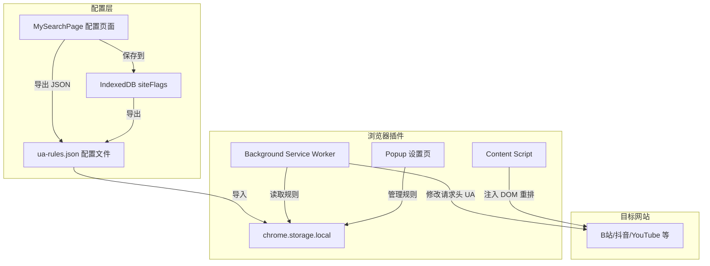
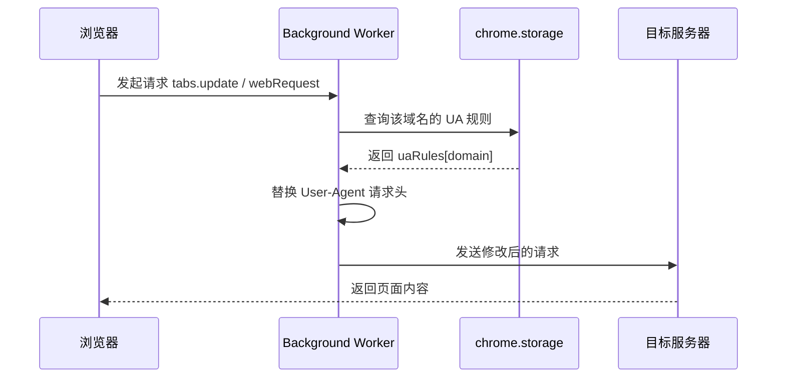
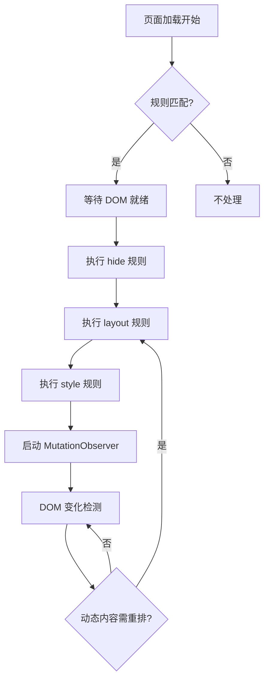
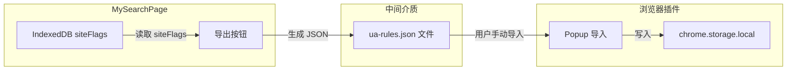

# MySearchPage 浏览器插件架构设计

## 1. 项目概述

在 MySearchPage 项目基础上新建分支 `feature/browser-extension`，开发一个浏览器插件（WebExtension），实现：

- **功能1**：按站点精确控制 User-Agent（如 YouTube→手机UA，B站/抖音→桌面UA）
- **功能2**：B站/抖音在桌面UA下，通过 DOM 重排实现手机风格的 UI 布局
- **跨平台**：桌面端 Chrome/Edge/Firefox + 手机端 Firefox Android
- **配置中心**：MySearchPage 作为配置管理页面，插件读取配置执行

---

## 2. 整体架构



---

## 3. 插件目录结构

```
MySearchPage/
├── mysearch.html                    # 现有配置页面（增加 UA 规则导出功能）
├── extension/                       # 浏览器插件（新目录）
│   ├── manifest.json                # 插件清单
│   ├── background/
│   │   └── ua-controller.js         # UA 控制模块（修改请求头）
│   ├── content/
│   │   ├── ui-transformer.js        # DOM 重排引擎（通用）
│   │   ├── sites/
│   │   │   ├── bilibili.js          # B站专属重排规则
│   │   │   └── douyin.js            # 抖音专属重排规则
│   │   └── styles/
│   │       ├── bilibili-mobile.css  # B站手机风格 CSS
│   │       └── douyin-mobile.css    # 抖音手机风格 CSS
│   ├── popup/
│   │   ├── popup.html               # 插件弹窗 UI
│   │   ├── popup.css
│   │   └── popup.js
│   ├── options/
│   │   ├── options.html             # 插件设置页（高级配置）
│   │   ├── options.css
│   │   └── options.js
│   ├── shared/
│   │   ├── config.js                # 配置管理（读写 chrome.storage）
│   │   ├── constants.js             # 常量定义（默认UA字符串等）
│   │   └── utils.js                 # 工具函数
│   ├── icons/
│   │   ├── icon16.png
│   │   ├── icon48.png
│   │   └── icon128.png
│   └── _locales/                    # 国际化（可选）
│       ├── zh_CN/messages.json
│       └── en/messages.json
├── SiteUrls.json                    # 现有站点配置
└── pinyin_dict_firstletter.js       # 现有拼音字典
```

---

## 4. manifest.json 设计

```json
{
  "manifest_version": 3,
  "name": "MySearchPage UA Controller",
  "version": "1.0.0",
  "description": "按站点控制 User-Agent，支持桌面UA下手机UI布局",
  "permissions": [
    "webRequest",
    "webRequestBlocking",
    "storage",
    "activeTab",
    "tabs",
    "scripting"
  ],
  "host_permissions": [
    "*://*.bilibili.com/*",
    "*://*.douyin.com/*",
    "*://*.youtube.com/*",
    "*://*.google.com/*",
    "*://*.xiaohongshu.com/*"
  ],
  "background": {
    "service_worker": "background/ua-controller.js"
  },
  "content_scripts": [
    {
      "matches": ["*://*.bilibili.com/*"],
      "js": ["shared/constants.js", "shared/utils.js", "content/sites/bilibili.js"],
      "css": ["content/styles/bilibili-mobile.css"],
      "run_at": "document_start"
    },
    {
      "matches": ["*://*.douyin.com/*"],
      "js": ["shared/constants.js", "shared/utils.js", "content/sites/douyin.js"],
      "css": ["content/styles/douyin-mobile.css"],
      "run_at": "document_start"
    }
  ],
  "action": {
    "default_popup": "popup/popup.html",
    "default_icon": {
      "16": "icons/icon16.png",
      "48": "icons/icon48.png",
      "128": "icons/icon128.png"
    }
  },
  "options_page": "options/options.html",
  "icons": {
    "16": "icons/icon16.png",
    "48": "icons/icon48.png",
    "128": "icons/icon128.png"
  }
}
```

> **注意**：Manifest V3 中 `webRequestBlocking` 仅在 Firefox 中可用。Chrome MV3 需要使用 `declarativeNetRequest` API 替代。后续会提供兼容方案。

---

## 5. UA 控制模块设计

### 5.1 数据流



### 5.2 UA 规则配置格式

```json
{
  "uaRules": {
    "youtube.com": {
      "enabled": true,
      "uaMode": "mobile",
      "customUA": null,
      "uiTransform": false
    },
    "bilibili.com": {
      "enabled": true,
      "uaMode": "desktop",
      "customUA": null,
      "uiTransform": true
    },
    "douyin.com": {
      "enabled": true,
      "uaMode": "desktop",
      "customUA": null,
      "uiTransform": true
    },
    "xiaohongshu.com": {
      "enabled": true,
      "uaMode": "mobile",
      "customUA": null,
      "uiTransform": false
    }
  }
}
```

### 5.3 预置 UA 字符串

```javascript
// shared/constants.js
const UA_PRESETS = {
  desktop: {
    chrome_windows: "Mozilla/5.0 (Windows NT 10.0; Win64; x64) AppleWebKit/537.36 (KHTML, like Gecko) Chrome/131.0.0.0 Safari/537.36",
    chrome_mac: "Mozilla/5.0 (Macintosh; Intel Mac OS X 10_15_7) AppleWebKit/537.36 (KHTML, like Gecko) Chrome/131.0.0.0 Safari/537.36"
  },
  mobile: {
    iphone: "Mozilla/5.0 (iPhone; CPU iPhone OS 17_0 like Mac OS X) AppleWebKit/605.1.15 (KHTML, like Gecko) Version/17.0 Mobile/15E148 Safari/604.1",
    android: "Mozilla/5.0 (Linux; Android 14; Pixel 8) AppleWebKit/537.36 (KHTML, like Gecko) Chrome/131.0.0.0 Mobile Safari/537.36"
  }
};
```

### 5.4 Chrome MV3 兼容方案

Chrome Manifest V3 不支持 `webRequestBlocking`，需要使用 `declarativeNetRequest`：

```json
// 动态规则，通过 chrome.declarativeNetRequest.updateDynamicRules 管理
{
  "id": 1,
  "priority": 1,
  "action": {
    "type": "modifyHeaders",
    "requestHeaders": [
      { "header": "User-Agent", "operation": "set", "value": "..." }
    ]
  },
  "condition": {
    "urlFilter": "*://*.bilibili.com/*",
    "resourceTypes": ["main_frame", "sub_frame", "xmlhttprequest"]
  }
}
```

Firefox 保持使用 `webRequest.onBeforeSendHeaders`。

---

## 6. DOM 重排模块设计

### 6.1 通用重排引擎



### 6.2 重排规则格式

```javascript
// content/sites/bilibili.js
const BILIBILI_RULES = {
  // 需要隐藏的元素（使用属性选择器模糊匹配 hash class）
  hide: [
    '.bili-header__bar',           // 顶部导航栏（桌面版特有）
    '[class*="sidebar"]',          // 侧边栏
    '[class*="right-section"]',    // 右侧推荐栏
    '[class*="ad-layer"]',         // 广告层
  ],

  // 布局调整
  layout: [
    {
      selector: '[class*="main-content"]',
      styles: {
        width: '100%',
        maxWidth: '100%',
        margin: '0',
        padding: '8px'
      }
    },
    {
      selector: '[class*="video-card"]',
      styles: {
        width: '100%',
        maxWidth: '100%',
        fontSize: '16px'
      }
    }
  ],

  // 全局样式覆盖
  globalStyles: {
    'body': {
      fontSize: '16px',
      lineHeight: '1.6',
      overflowX: 'hidden'
    },
    'a, button, input, [role="button"]': {
      minHeight: '44px',   // 触摸目标最小 44px
      minWidth: '44px'
    }
  },

  // viewport 设置
  viewport: {
    width: 'device-width',
    initialScale: '1.0'
  }
};
```

### 6.3 B站重排策略

B站桌面版的核心布局结构：

```
┌──────────────────────────────────────────────┐
│  Header（顶部导航）                            │
├──────┬───────────────────────┬───────────────┤
│      │                       │               │
│ Side │   Main Content        │  Right Panel  │
│ bar  │   （视频列表/详情）     │  （推荐/广告） │
│      │                       │               │
├──────┴───────────────────────┴───────────────┤
│  Footer                                       │
└──────────────────────────────────────────────┘
```

重排后目标：

```
┌──────────────────────┐
│  简化 Header          │
├──────────────────────┤
│                      │
│  Main Content        │
│  （全宽，单列）        │
│  字体 16px+          │
│  触摸目标 44px+       │
│                      │
├──────────────────────┤
│  Footer（可选隐藏）    │
└──────────────────────┘
```

**关键实现**：

1. **选择器策略**：不依赖精确 class 名，使用 `[class*="keyword"]` 模糊匹配
2. **MutationObserver**：监听 DOM 变化，对动态加载内容重新应用规则
3. **CSS 优先级**：使用 `!important` 覆盖网站原生样式
4. **SPA 路由兼容**：监听 `popstate` 和 `pushState`，路由切换时重新执行重排

### 6.4 抖音重排策略

抖音桌面版是重度 SPA（单页应用），DOM 结构高度动态。

**策略差异**：
- 抖音桌面版核心是**全屏视频播放器**布局
- 重排目标：将视频卡片改为纵向列表，放大控件
- 难点：抖音大量使用 Canvas 渲染和 Shadow DOM

**分阶段实现**：
1. **Phase 1**：基础 CSS 缩放 + 隐藏侧边元素
2. **Phase 2**：针对搜索结果页重排卡片布局
3. **Phase 3**：视频播放页面的触控优化

---

## 7. 配置同步机制

### 7.1 方案：JSON 文件导入/导出

MySearchPage 已有 [`desktopMode`](mysearch.html:1866) 字段，扩展为完整的 UA 规则：



### 7.2 MySearchPage 侧改动

在设置模态框中新增"导出 UA 规则"按钮，将 `siteFlags` 中的 `desktopMode` 字段转换为插件的 `uaRules` 格式：

```javascript
// mysearch.html 中新增的导出逻辑
function exportUARules() {
    const uaRules = {};
    Object.keys(siteFlags).forEach(site => {
        const flags = siteFlags[site];
        const url = siteUrls[site] || '';
        let domain = '';
        try { domain = new URL(url).hostname; } catch(e) {}

        if (domain) {
            uaRules[domain] = {
                enabled: true,
                uaMode: flags.desktopMode ? 'desktop' : 'mobile',
                customUA: null,
                uiTransform: flags.desktopMode && 
                    (domain.includes('bilibili') || domain.includes('douyin'))
            };
        }
    });

    const blob = new Blob([JSON.stringify({ uaRules }, null, 2)], 
        { type: 'application/json' });
    const a = document.createElement('a');
    a.href = URL.createObjectURL(blob);
    a.download = 'ua-rules.json';
    a.click();
}
```

### 7.3 插件侧导入

Popup 页面提供文件选择器，读取 JSON 后写入 `chrome.storage.local`。

---

## 8. Popup 设计

```
┌─────────────────────────────┐
│  MySearchPage UA Controller  │
│  ─────────────────────────  │
│                             │
│  🟢 全局开关：已启用          │
│                             │
│  ┌───────────────────────┐  │
│  │ bilibili.com    🖥️ 桌面│  │
│ │  ✅ UI重排已启用        │  │
│  └───────────────────────┘  │
│  ┌───────────────────────┐  │
│  │ douyin.com      🖥️ 桌面│  │
│ │  ✅ UI重排已启用        │  │
│  └───────────────────────┘  │
│  ┌───────────────────────┐  │
│  │ youtube.com     📱 手机│  │
│ │  UI重排：不适用         │  │
│  └───────────────────────┘  │
│                             │
│  [导入配置] [导出配置] [设置] │
└─────────────────────────────┘
```

---

## 9. 演进路线图

### Phase 1：基础 UA 控制（起点）

- [ ] 创建 `feature/browser-extension` 分支
- [ ] 搭建插件骨架（manifest.json + 目录结构）
- [ ] 实现 UA 控制模块（Chrome MV3 declarativeNetRequest + Firefox webRequest）
- [ ] 实现 Popup 基础 UI（规则列表 + 开关）
- [ ] 实现 JSON 配置导入/导出
- [ ] MySearchPage 增加"导出 UA 规则"按钮

### Phase 2：B站 DOM 重排

- [ ] 分析 B站桌面版 DOM 结构，编写选择器规则
- [ ] 实现 B站 Content Script（隐藏侧边栏、单列布局、字体放大）
- [ ] 实现 MutationObserver 持续监控
- [ ] 编写 `bilibili-mobile.css`
- [ ] 测试 B站主要页面：首页、搜索页、视频详情页、历史页、收藏页

### Phase 3：抖音 DOM 重排

- [ ] 分析抖音桌面版 DOM 结构
- [ ] 实现抖音 Content Script
- [ ] 编写 `douyin-mobile.css`
- [ ] 测试抖音主要页面：搜索页、视频播放页

### Phase 4：API 逆向（远期演进）

- [ ] 研究 B站 API（参考 bilibili-API-collect 项目）
- [ ] 实现插件内的 API 代理模块
- [ ] 对复杂页面（如视频播放）使用 API + 自建 UI 替代 DOM 重排
- [ ] 抖音 API 逆向研究

---

## 10. 跨浏览器兼容性

| 特性 | Chrome MV3 | Firefox MV2/MV3 | Edge MV3 |
|------|-----------|-----------------|----------|
| UA 修改 | `declarativeNetRequest` | `webRequest.onBeforeSendHeaders` | 同 Chrome |
| Content Script | ✅ | ✅ | ✅ |
| chrome.storage | ✅ | ✅ | ✅ |
| Service Worker | ✅ | ✅ (MV3) / Background Page (MV2) | ✅ |

**兼容策略**：构建时根据目标浏览器生成不同的 manifest.json，UA 控制模块做双实现。

---

## 11. 风险与缓解

| 风险 | 概率 | 影响 | 缓解措施 |
|------|------|------|---------|
| B站/抖音更新导致 DOM 重排失效 | 高 | 中 | 使用模糊选择器 + MutationObserver 自动修复 |
| Chrome MV3 限制 UA 修改能力 | 低 | 高 | declarativeNetRequest 已支持 modifyHeaders |
| 抖音 Shadow DOM 阻止 CSS 注入 | 中 | 中 | 使用 `shadowRoot.querySelector` 穿透 |
| Firefox Android 市场份额低 | 中 | 低 | 可后续开发 APK WebView 壳作为补充 |
| 网站检测到插件行为 | 低 | 高 | Content Script 不修改 JS 运行环境，仅操作 DOM/CSS |
